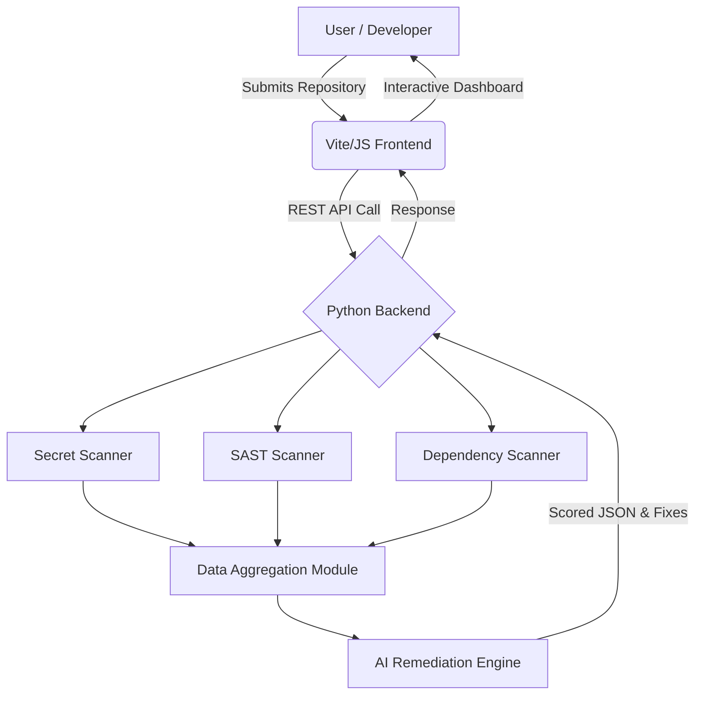
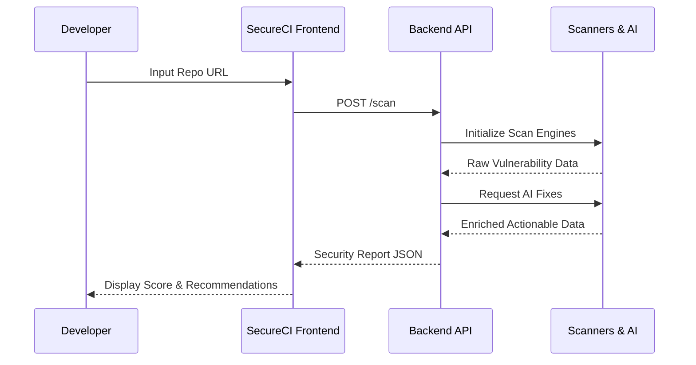

# 🛡️ SecureCI

### AI-Powered DevSecOps Security Auditor

*Scan, Analyze, and Secure your repositories before they reach production.*

---

## 2. Introduction

**SecureCI** is an intelligent, AI-powered DevSecOps web application built to bridge the gap between development speed and software security. In today's fast-paced agile environments, security is often treated as an afterthought, leading to exposed secrets, vulnerable dependencies, and insecure configurations.

SecureCI automatically scans code repositories to detect these vulnerabilities, providing developers with real-time risk analysis, a standardized security score, and AI-generated actionable fixes. By shifting security "left," SecureCI empowers developers to write secure code and deploy applications with absolute confidence.

## 3. Problem Statement

The modern software development lifecycle (SDLC) faces critical security bottlenecks:

* **Vulnerable Dependencies:** Integrating third-party open-source libraries often introduces unpatched vulnerabilities into the supply chain.
* **Exposed Secrets:** Hardcoded API keys, database credentials, and access tokens are frequently pushed to version control systems by mistake.
* **Delayed Vulnerability Detection:** Traditional security audits occur right before deployment or after a breach, making remediation expensive and time-consuming.
* **Lack of Actionable Fixes:** Conventional security tools dump massive logs of errors without providing developers the exact steps required to patch the code.

## 4. Solution Overview

SecureCI resolves these challenges by embedding intelligent security auditing directly into the developer workflow.

Users can link or upload their repositories directly to the SecureCI web platform. Upon initialization, the Python-driven backend spins up parallel scanning engines to inspect the codebase for exposed secrets, SAST (Static Application Security Testing) vulnerabilities, and misconfigurations. The results are aggregated, analyzed by an AI engine to reduce false positives and suggest exact code fixes, and ultimately presented on an intuitive Vite-powered React dashboard.

## 5. Key Features

* 🔍 **Comprehensive Repository Scanning:** Deep-level inspection of source code files, configurations, and environment templates.
* 🤖 **AI-Powered Remediation:** Context-aware, AI-generated patches and explanations for detected vulnerabilities.
* 📊 **Risk Prioritization & Scoring:** Quantifiable security grading (A to F) based on severity, allowing teams to prioritize critical fixes.
* 🔑 **Secrets Detection:** Automated discovery of hardcoded credentials, API keys, and tokens before they reach production.
* 📦 **Dependency Analysis:** Evaluation of `package.json` and `requirements.txt` for known CVEs.
* 🐳 **Container Scanning Ready:** Infrastructure-as-Code (IaC) and Dockerfile configuration analysis.
* ⚡ **Real-Time Auditing Dashboard:** A modern, highly responsive frontend for visualizing security metrics.
* 🚀 **DevSecOps Automation:** Fully containerized setup via `docker-compose` for seamless CI/CD pipeline integration.

## 6. How the System Works

1. **Input:** The user connects a GitHub repository or uploads local source code via the SecureCI dashboard.
2. **Execution:** The React frontend sends a payload to the Python backend API.
3. **Multi-Vector Scanning:** The backend orchestrates various security tools to perform SAST, SCA, and secrets scanning.
4. **AI Contextualization:** Raw scan logs are parsed and sent to an AI engine to determine context and draft human-readable fixes.
5. **Aggregation:** Vulnerabilities are mapped, scored (Critical, High, Medium, Low), and packaged into a JSON response.
6. **Visualization:** The frontend renders interactive charts, vulnerability lists, and actionable code snippets for the developer.

## 7. Architecture Overview

SecureCI utilizes a decoupled client-server architecture:

* **Frontend:** A Vite-based JavaScript application handling user interactions, API requests, and data visualization.
* **Backend:** A robust Python application that manages business logic, executes terminal-level security tools, and communicates with AI engines.
* **Infrastructure:** Docker and Docker Compose orchestrate the application environment, ensuring consistency across development and deployment.

### System Architecture Diagram



### DevSecOps Workflow Diagram



## 8. Tech Stack

| Category | Technology |
| --- | --- |
| **Frontend** | React (implied), Vite, JavaScript, CSS |
| **Backend** | Python (FastAPI/Flask ecosystem) |
| **Orchestration** | Docker, Docker Compose |
| **AI Engine** | LLM Integration (OpenAI/Local) |
| **Deployment** | Vercel (`vercel.json` supported) |
| **Dev Tools** | TypeScript Config, Node.js (`package.json`) |

## 9. Folder Structure

```text
📦 TEAM-ENCODERS__DevSecOps-Security-Auditor__TRIVERSE
 ┣ 📂 backend/               # Python API, security scanners, AI logic
 ┣ 📂 src/                   # Frontend source code (Vite/React)
 ┣ 📜 .env.example           # Environment variables template
 ┣ 📜 docker-compose.yml     # Multi-container Docker orchestration
 ┣ 📜 package.json           # Node.js dependencies
 ┣ 📜 vite.config.js         # Vite bundler configuration
 ┣ 📜 vercel.json            # Vercel deployment configuration
 ┗ 📜 tsconfig.json          # TypeScript configurations

```

## 10. Installation Guide

Follow these beginner-friendly steps to run SecureCI on your local machine.

### Prerequisites

* [Node.js](https://www.google.com/search?q=https://nodejs.org/) (v16+)
* [Python](https://www.google.com/search?q=https://www.python.org/) (v3.9+)
* [Docker Desktop](https://www.google.com/search?q=https://www.docker.com/) (Optional but recommended)

### Step 1: Clone the Repository

```bash
git clone https://github.com/AaryaKHirematha/TEAM-ENCODERS__DevSecOps-Security-Auditor__TRIVERSE.git
cd TEAM-ENCODERS__DevSecOps-Security-Auditor__TRIVERSE

```

### Step 2: Set up Environment Variables

```bash
cp .env.example .env
# Open .env and add your required keys (e.g., AI API keys)

```

### Step 3: Run via Docker (Recommended)

The easiest way to spin up both frontend and backend seamlessly:

```bash
docker-compose up --build

```

*The frontend will be available at `http://localhost:5173` (default Vite port) and the backend API at `http://localhost:8000`.*

---

*(Alternative) Manual Setup:*

### Step 4: Start the Backend

```bash
cd backend
python -m venv venv
source venv/bin/activate  # On Windows: venv\Scripts\activate
pip install -r requirements.txt
python main.py # (or uvicorn main:app --reload depending on framework)

```

### Step 5: Start the Frontend

```bash
# In a new terminal from the root folder
npm install
npm run dev

```

## 11. Environment Variables

| Variable | Description | Required |
| --- | --- | --- |
| `VITE_API_BASE_URL` | Endpoint for the Python Backend | Yes |
| `AI_API_KEY` | Key for the AI remediation model | Yes |
| `PORT` | Backend port override | No |

## 12. Running the Project

Once the application is running:

1. Open your browser and navigate to `http://localhost:5173`.
2. Click **"New Scan"** and input the URL of a public GitHub repository.
3. Wait for the pipeline to execute. The backend will pull the code and run its security heuristics.
4. Access the **Dashboard** to view your Security Score, identified vulnerabilities, and AI-suggested code patches.

## 13. Security Features

* **Static Application Security Testing (SAST):** Analyzes source code to identify structural weaknesses (e.g., SQL Injection, XSS).
* **Software Composition Analysis (SCA):** Cross-references `package.json` dependencies against CVE databases.
* **Secrets Detection:** Uses entropy algorithms to detect hardcoded API keys, JWTs, and passwords.
* **Risk Scoring Algorithm:** Dynamically grades your project to give stakeholders an immediate understanding of the security posture.
* **Misconfiguration Checks:** Scans Dockerfiles and environment setups for non-root execution and privilege escalation flaws.

## 14. DevSecOps Pipeline

SecureCI represents the **"Shift-Left"** methodology. By running these checks locally or connecting them via CI/CD (GitHub Actions), development teams can catch vulnerabilities *before* they are merged into the main branch.

* **Continuous Integration:** Fails the build if a Critical vulnerability or exposed secret is found.
* **Continuous Remediation:** Doesn't just find bugs; uses AI to provide developers the immediate diff to fix them, reducing friction between Security and DevOps teams.

## 15. Screenshots Section

*(Add screenshots of your application here)*

| Dashboard Overview | Vulnerability Report | AI Remediation |
| --- | --- | --- |
| `[Screenshot 1]` | `[Screenshot 2]` | `[Screenshot 3]` |

## 16. Real-World Use Cases

* **Startups & Indie Hackers:** Audit MVPs quickly to ensure no database credentials get pushed to public repos.
* **Security & DevOps Teams:** Integrate as a pre-commit or CI tool to block insecure deployments automatically.
* **Open-Source Maintainers:** Provide a public badge and security score for community projects.
* **Students & Beginners:** Learn secure coding practices through AI-generated explanations of vulnerabilities.

## 17. Unique Differentiators

Unlike standard CLI-based security tools (which output dense, hard-to-read terminal logs), SecureCI combines **aggregate scanning** with **AI intelligence**. It acts as a virtual security engineer that not only flags the issue but explains *why* it's dangerous and writes the code to fix it.

## 18. Scalability & Future Scope

* **IDE Extensions:** Building VS Code plugins to scan code directly in the editor.
* **Multi-Language Support:** Expanding SAST to fully support Go, Rust, and Java.
* **Automated Pull Requests:** Having the AI automatically create PRs with the necessary security patches.
* **Cloud Security Posture Management (CSPM):** Integrating AWS/GCP checks.

## 19. Challenges Faced

* **False Positives:** Balancing scanner strictness to avoid overwhelming developers with non-issues. Overcame this by implementing AI context-checking.
* **Docker Orchestration:** Ensuring various underlying security CLI tools ran smoothly inside isolated containerized environments.
* **Performance:** Optimizing the speed of cloning, scanning, and analyzing large repositories asynchronously.

## 20. Learning Outcomes

Throughout the development of SecureCI, TEAM-ENCODERS gained profound insights into:

* **DevSecOps Workflows:** Understanding how CI/CD pipelines function and how to secure them.
* **Containerization:** Mastering Docker and `docker-compose` for multi-tier app deployment.
* **AI Integration:** Effectively prompting and utilizing Large Language Models for secure code analysis.
* **System Design:** Architecting a decoupled JS-Frontend and Python-Backend application.

## 21. Team Details

**TEAM-ENCODERS**

* Developed for **TRIVERSE Hackathon / Project Showcase**.
* **GitHub Profile:** [AaryaKHirematha](https://www.google.com/search?q=https://github.com/AaryaKHirematha)

## 22. Contribution Guidelines

We welcome community contributions! To contribute:

1. Fork the repository.
2. Create a new branch (`git checkout -b feature/amazing-feature`).
3. Commit your changes (`git commit -m 'Add amazing feature'`).
4. Push to the branch (`git push origin feature/amazing-feature`).
5. Open a Pull Request.

## 23. License

This project is licensed under the [MIT License](https://www.google.com/search?q=https://opensource.org/licenses/MIT).

## 24. Acknowledgements

* Thanks to the **TRIVERSE** team for the inspiration and platform.
* Open-source security tools that paved the way for modern DevSecOps methodologies.

## 25. Contact Section

For queries, support, or collaboration, please open an issue in the repository or reach out via GitHub.

---

### 🚀 EXTRA OUTPUTS

**1. GitHub Repository Short Description**
AI-powered DevSecOps platform that scans repositories for vulnerabilities, exposed secrets, and misconfigurations, providing real-time scoring and AI-generated fixes.

**2. Professional Elevator Pitch**
"SecureCI is an AI-driven DevSecOps auditor that shifts security left. It automatically scans repositories for vulnerabilities and secrets, replacing complex security logs with a unified dashboard, clear risk scores, and AI-generated code patches. It enables developers to build fast while staying secure."

**3. LinkedIn Showcase Description**
Excited to showcase **SecureCI**, built by TEAM-ENCODERS! 🛡️ SecureCI is an AI-powered DevSecOps web app that seamlessly integrates into the development workflow to scan code for vulnerabilities, exposed secrets, and misconfigurations. Instead of just highlighting problems, it uses AI to provide actionable fixes before deployment. A big step towards making software security accessible and automated! Check out the architecture and code on our GitHub. #DevSecOps #CyberSecurity #AI #WebDevelopment #TeamEncoders

**4. Resume Project Description**
**SecureCI - AI-Powered DevSecOps Security Auditor**

* Architected a full-stack DevSecOps platform using Vite, React, and Python, containerized with Docker.
* Integrated AI and multiple security engines to perform SAST, SCA, and secrets detection on code repositories.
* Developed an intuitive dashboard delivering real-time risk scores and automated AI-driven remediation code patches.
* Achieved automated, isolated scanning environments utilizing Docker Compose for seamless CI/CD pipeline integration.

**5. 10 GitHub Topics/Tags**
`devsecops`, `security-scanner`, `vulnerability-detection`, `ai-security`, `sast`, `secrets-management`, `docker`, `python-backend`, `vite-react`, `cybersecurity`

**6. Demo Presentation Intro**
"Hello everyone, we are TEAM-ENCODERS. Today, we're thrilled to present SecureCI. In modern development, pushing insecure code is easy, but fixing it is hard. SecureCI bridges that gap. It's an AI-powered DevSecOps auditor that scans your repository, scores your security posture, and physically writes the code to fix your vulnerabilities before you ever reach production."

**7. One-line Hackathon Pitch**
"SecureCI is an AI-powered DevSecOps web app that acts as an automated security engineer, finding and fixing code vulnerabilities before they reach production."
